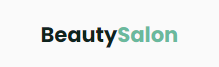
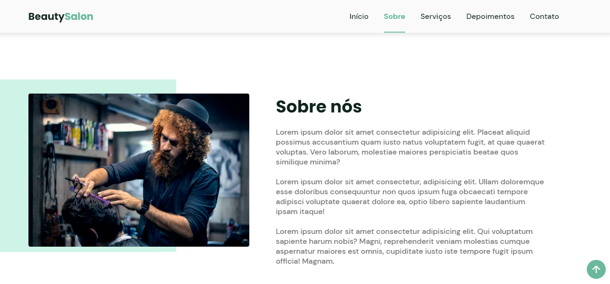

<h1 align="center">
  
</h1>

  <a href="#-tecnologies">Tecnologies</a>&nbsp;&nbsp;&nbsp;|&nbsp;&nbsp;&nbsp;
  <a href="#-project">Project</a>

 

 

  

## 🚀 Tecnologies

This project was developed with the following technologies:

- HTML
- CSS
- JavaScript

## 💻 Project

BeautySalon is a project created to Beauty salons and barbershops, it is a design that can be changed very quickly for many types of clients in the beauty business..

